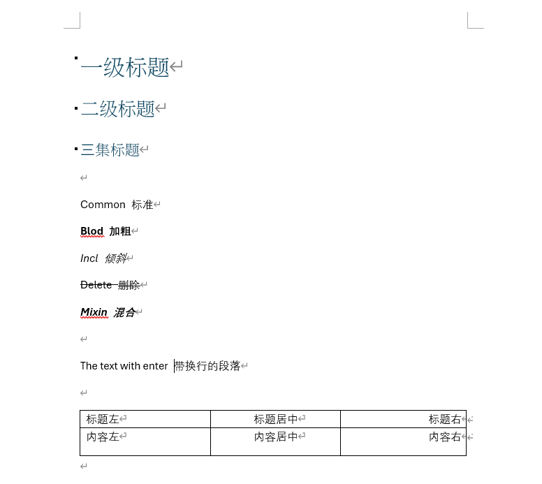
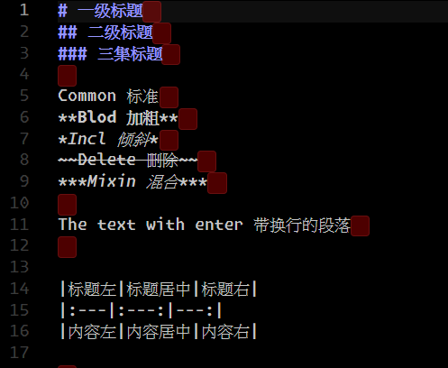

# Doc2Md

The simple way to make your Word Docs to Markdown.  
简单的让你的 Word 文档转到 Markdown。

## Preview 预览

|Word|Markdown|
|:---:|:---:|
|||

## Usage 使用

Download it from [releases](https://github.com/AmarokIce/Doc2Mk/releases).  
从 [Releases](https://github.com/AmarokIce/Doc2Mk/releases) 下载适合的版本。

And use the command:  
然后使用指令处理:

```shell
./doc2md.exe ./[your word docx name].docx
```

## Build by your self for your OS 为你当前平台编译

Download [D Compiler](https://dlang.org/) (Like DMD)

Make sure you have dub(If you install the GDC or LDC by your software manager).

Then, just build it and run: `dub build`.

